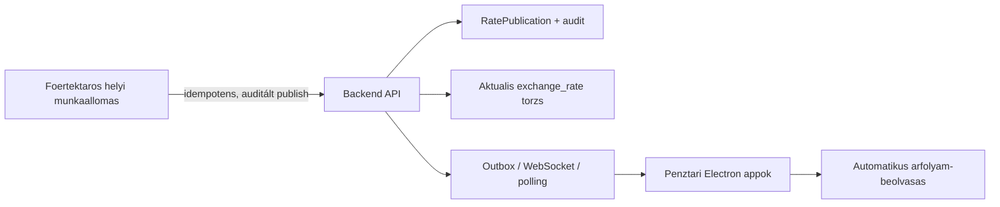

# Felmeres es Anti legacy tudaslefedettsegi audit

Datum: 2026-05-12

Scope:

- `D:\repo\valutavalto-program\Felmérés\Valuta`
- `D:\repo\valutavalto-program\Anti`
- repo memoria: QMD, YAML, Cognee/SQLite, vault, Obsidian mirror

Cel:

- Ellenorizni, hogy a program keszrefejlesztesehez szukseges legacy es felmeresi tudas valoban jelen van-e a repo memoriajaban.
- Szetszedni, mi van mar tartalomkent feldolgozva, mi csak leltarozva, es mi hianyos.
- Kijelolni, mely legacy funkciok tartozzanak a kulon helyi "Kozponti helyi munkaallomas" Electron alkalmazasba, melyek maradjanak szerveroldali hatterfolyamatok, es melyek tartozzanak a penztari kliensbe.

## Vezetoi kovetkeztetes

A repo memoriaja mukodik es jelentos mennyisegu tudast tartalmaz, de a felhasznaloi gyanu jogos: a legacy program nincs minden reszeben "teljesen visszafejtve" olyan melysegben, hogy minden binaris, minden kep, minden Firebird adatbazis es minden archivum tartalma egyforman ertett, keresheto es funkciohoz rendelt legyen.

A jelenlegi allapot harom retegbol all:

1. Eros leltar es topologia: a fajlok, modulok, DLL/EXE csaladok, forrasgyokerek es sok funkcioklaszter mar jol fel vannak terkepezve.
2. Reszleges kodszintu tudas: a Delphi/Pascal, DFM es Java forrasok jelentos resze indexelt, a fo VALUTA, SZERVER, ARFOLYAM, kamera es penztari modulokrol mar vannak osszefoglalo reverse-engineering dokumentumok.
3. Hianyos mely feldolgozas: sok EXE/DLL meg csak metadata/binary-string szinten ismert, a kepekhez sok helyen OCR kell, tobb archivum nincs kibontva a tudastarban, Firebird DB-k nagy resze csak sema-clue szinten van, es a Felmeres kep/audio anyagoknal is maradtak nyitott ingest gap-ek.

Ez nem azt jelenti, hogy "nincs tudasa" a reponak. Inkabb azt, hogy van alap, de a keszrefejleszteshez kotelezo bevezetni egy gap-zarasi munkarendet: P0 legacy modulonkent source/binary/adatformat/parity bizonyitekot kell csatolni, mielott az adott modern funkciot kesznek mondjuk.

## Memoria infrastruktura statusz

Ellenorzott parancs:

```powershell
npm run memory:status
```

Eredmeny:

- QMD memoria: OK
- YAML memoria: OK
- Cognee/SQLite memoria: OK
- vector/obsidian/reports fajlok: OK
- Cognee local service: healthy, `status: ready`, `version: 0.5.6-local`
- Live Obsidian REST plugin: nem elerheto
  - `https://127.0.0.1:27124/`: `fetch failed`
  - `http://127.0.0.1:27123/`: `fetch failed`

Kovetkeztetes:

- A repo oldali Obsidian/vault mirror hasznalhato.
- A helyi Obsidian alkalmazas elinditasa onmagaban nem eleg: a Local REST plugin vagy port/engedely meg nem lathato innen. A memoria frissitese ettol meg a repo fajlrendszerbe es Cognee-ba elvegezheto.

## SQLite tudasbazis bizonyitek

Forras:

- `D:\repo\valutavalto-program\docs\valuta-knowledge.sqlite`
- ingest script: `D:\repo\valutavalto-program\docs\valuta-kb-ingest-filesystem.py`

Fontos megfigyeles az ingest scriptbol:

- Az ingest gyokerek kozott szerepel:
  - `Anti -> D:/repo/valutavalto-program/Anti`
  - `Felmeres -> D:/repo/valutavalto-program/Felmérés`
- A script leirasa szerint nem teljes OCR/ASR/tartalom-extract celra keszult, hanem auditalhato inventory es ingest ledger letrehozasara.

Ez kulcsfontossagu: a KB jo alapleltar, de nem minden artefaktum teljes szoveges/kodszintu megertese.

### SQLite tabla-meretek

| Tabla | Sor |
| --- | ---: |
| `source_artifacts` | 39648 |
| `artifact_ingest_runs` | 61167 |
| `artifact_dedup_groups` | 13486 |
| `artifact_dedup_members` | 39635 |
| `artifact_text_extracts` | 20473 |
| `felmeres_docs` | 431 |
| `legacy_binary_inventory` | 2157 |
| `legacy_dll_parity_matrix` | 41 |
| `firebird_db_artifacts` | 92 |
| `knowledge_coverage` | 38 |
| `knowledge_gaps` | 3719 |

### Forrasgyoker osszesito

| Source root | Artefaktum | Meret |
| --- | ---: | ---: |
| `Anti` | 39159 | 6233706295 byte |
| `Felmeres` | 459 | 1034839093 byte |
| `RepoDocs` | 30 | 204221 byte |

## Felmeres\Valuta audit

Vizsgalt mappa:

- `D:\repo\valutavalto-program\Felmérés\Valuta`

Fajlszam:

- 416 fajl
- kb. 986.90 MB

Top-level szerkezet:

| Mappa | Fajl | Meret |
| --- | ---: | ---: |
| `Cégcsoport felmérése` | 102 | 377.56 MB |
| `Hálózati és számítógép felmérés` | 37 | 11.33 MB |
| `Kósa Szervezés` | 131 | 397.90 MB |
| `Kósa Tervezés és fejlesztés` | 46 | 194.74 MB |
| `Szervezés` | 6 | 3.36 MB |
| `v2.0` | 90 | 1.42 MB |

Kiemelt top-level fajlok:

- `Árfolyam karbantartó hibalista.docx`
- `Delphi Licence árak.xlsx`
- `penztari_mozgasok.PNG`
- `Terrorlista2008.txt`

### Kiterjesztes szerinti leltar

| Kiterjesztes | Darab |
| --- | ---: |
| `.jpeg` | 90 |
| `.docx` | 88 |
| `.jpg` | 63 |
| `.md` | 45 |
| `.html` | 45 |
| `.xlsx` | 27 |
| `.PNG` | 25 |
| `.m4a` | 8 |
| `.txt` | 7 |
| `.ods` | 5 |
| `.csv` | 4 |
| `.docm` | 2 |
| `.odt` | 2 |
| `.pdf` | 2 |
| `.7z` | 1 |
| `.rqm` | 1 |
| `.zip` | 1 |

### Tartalmi csaladok

1. Arfolyamkeszito kovetelmenyek es hibak
   - `Követelménylista - Árfolyamkészítés.docx`
   - `Árfolyam karbantartó hibalista.docx`
   - arfolyamkezelo screenshotok: 0-s lap, csoportkarbantarto, kikuldes log, csoport-lap, stb.

2. Uzleti igenyfelmeres es szervezeti interjuk
   - `RSL Igényfelmérési interjú összefoglaló 2024.02.12`
   - `RSL 2. Igényfelmérési interjú összefoglaló 2024.02.15`
   - `Kósa cégcsoport első igényfelmérési kérdések`
   - `kerdesek.docx`

3. Mukodesi specifikaciok
   - `c.docm.docx`: adatmodell es uzleti entitasok
   - `sztorno.docx`: sztorno folyamat
   - `zaras_ablak.docx`: zarasi folyamat
   - `Kósa cégcsoport fejlesztés lépései.docx`: roadmap/modulterv

4. v2.0 folyamatmodell
   - `v2.0\Markdown\valuta_folyamatok\modulstruktura.md`
   - `01_alapfolyamatok.md`
   - `02_penztarkezeles.md`
   - `03_tranzakciok.md`
   - `05_ugyfelkezeles.md`
   - `07_cimletkezeles.md`
   - `crud_komponensek.md`

5. Halozati es gepfelmeres
   - telephelyi kliens/szerver/gep dokumentumok
   - Békéscsaba, Debrecen, Kaposvár, Pécs, Szeged, Szekszárd, stb.

6. Excel/ODS/CSV/TXT segedanyagok
   - atlagarfolyam, forgalom, keszlet, havi atadas-atvetel, kezelesi koltseg, banki import, terrorlista, ugyfeles jelentesek.

7. Audio es kep bizonyitekok
   - 8 darab `.m4a` hangfelvetel.
   - sok kepernyokep es bizonylatkep.

### Felmeres tudastar-lefedettseg

SQLite `knowledge_coverage` szerint a `Felmeres` root lefedettsege magasnak tunik:

| Tema | Seen | Indexed | Blocked | Coverage |
| --- | ---: | ---: | ---: | ---: |
| `survey-requirements` | 459 | 416 | 188 | 90.63% |
| `reservations-booking` | 219 | 207 | 170 | 94.52% |
| `receipts-printing` | 39 | 37 | 35 | 94.87% |
| `audio-video-transcripts` | 8 | 8 | 8 | 100.00% |
| `ui-screenshots-and-receipt-images` | 178 | 178 | 178 | 100.00% |
| tobb kisebb domain | 2-13 | 2-13 | 0-12 | 100.00% |

Ezt ovatosan kell ertelmezni:

- A docx/html/md/xlsx tartalmak nagy resze tenyleg indexelt.
- A kepek sokszor csak fajlnev/kep-placeholder szinten jelennek meg, nem teljes OCR tartalommal.
- Az audio anyagokhoz vannak generalt ASR szovegek `docs\knowledge\generated\asr-text\` alatt, de az eredeti 8 audio artefaktum gap-kent is latszik. Ez valoszinuleg deduplikacios vagy ingest-statusz elteres: a tudas reszben megvan, de a gap ledger nincs lezart allapotban.

### Felmeres nyitott gap-ek

SQLite `knowledge_gaps` szerint:

| Gap tipus | Darab | Pelda |
| --- | ---: | --- |
| `asr-needed` | 8 | `Hang 002_sd.m4a` - `Hang 005_sd.m4a`, eredeti es Kosa duplicate peldanyok |
| `ocr-needed` | 10 | `Beállítások...jpeg`, `ERB Egyedi kötés.JPG`, `Szállítás pénztárak között menü.jpeg`, `Szerver szolgáltatások.jpeg`, `penztari_mozgasok.PNG` |
| `not-ingested` | 2 | `Békéscsaba-20240318T082026Z-001.zip`, `Régi Valuta program\forrasok.7z` |

Felmeres kovetkeztetes:

- A Felmeres memoriaja nem ures es nem felszines, de nem teljesen lezart.
- A programfejleszteshez mar hasznalhato, de minden olyan funkciohoz, amely kepen/audio-ban vagy archivumban van bizonyitva, kulon gap-zarast kell vegezni.

## Felmeresbol kinyert kulcs kovetelmenyek

Ezeket mar a memoria tobb helyen tartalmazza, de itt audit-szinten rogzitem:

- A csoport nem osszemoshato: Ekszer, Zalog, Valuta adatok logikailag kulon valasztandok.
- Valuta uzletag: kb. 180 dolgozo, 62 valutapenztar, 8 regio/ertektar.
- Foertektaros kezeli az arfolyamot es kuldi ki a penztaraknak.
- A kijelzok/pontok 5-20 perces frissitessel dolgoznak, cel jellemzoen 10 perc.
- A penztar a foertektar altal keszitett arfolyamot lassa/hasznalja, ne keszitse.
- Helyi Vodafone/adatkartyas internet eseten offline kimaradasnal a munka megallhat, ezert a modern rendszerben explicit offline/queue/ujraproba kell.
- Kezelesi koltseg kulon tranzakcio es kulon penztar/elszamolasi logika.
- Raiffeisen/Darius napi es havi elszamolasi folyamat kulon riport/export kovetelmeny.
- Arfolyamlogika:
  - AR001 alaplap: elszamolo arfolyam, OTP arfolyam, segedoszlop/szorzok, devizanemek, gyenge arfolyam, keresztarfolyamok.
  - AR002 csoportlap: csoportonként elszamolo arfolyam, alsó/középső/felső kedvezményhatár, pénztáros saját hatáskörű vételi/eladási limit.
  - 54 csoportos szemlélet a legacy arfolyam editorban.
  - Deviza lista kb. 28-30 elem, EUA specialis Euro-erme logikaval.
  - Raiffeisen kozepeltérés alapertelmezett max. 10%, parameterezheto.
  - EUA max. 20% elteres az Eurotol, kulon ugyfelkijelzesi kotelezettseg.
  - Pénztárosi napi kedvezmény limit: 5.
- Sztorno:
  - napi 3 sztorno limit per penztar/iroda jelleggel,
  - supervisor/penzugyi vezeto jovahagyas,
  - ellenkonyveles, nem torles.
- Bizonylatok:
  - prefix logika: V, E, F, U, FF, UF, B, K,
  - telephelykoddal induló folyamatos sorszam,
  - 2 peldany: ceg + ugyfel.
- Címlet:
  - címlet szerinti készletvezetes es atadas-atvetel lenyeges,
  - plomba max. 10 karakter.
- AML/KYC:
  - okmany scan bizonyos limiteknel,
  - terrorlista/szankcios lista,
  - PEP tipus tarolas,
  - forrasigazolas nagy osszegnel.
- Foglalo:
  - max. 2 nap,
  - no-show eseten kezelesi dij penztarba zaras.

## Anti audit

Vizsgalt mappa:

- `D:\repo\valutavalto-program\Anti`

Fajlszam:

- 32960 fajl
- kb. 5944.94 MB

Top-level szerkezet:

| Mappa | Fajl | Meret | EXE | DLL | PAS | DFM | DPR |
| --- | ---: | ---: | ---: | ---: | ---: | ---: | ---: |
| `SZERVER` | 25985 | 4204.88 MB | 1135 | 700 | 2881 | 2875 | 1430 |
| `camera3` | 3124 | 421.74 MB | 20 | 2 | 0 | 0 | 0 |
| `VALUTA` | 3049 | 328.23 MB | 155 | 129 | 420 | 419 | 279 |
| `camera2` | 461 | 211.46 MB | 2 | 0 | 0 | 0 | 0 |
| `camera` | 15 | 20.90 MB | 6 | 0 | 0 | 0 | 0 |
| `KORLEVEL_ZIP` | 233 | 15.93 MB | 1 | 0 | 0 | 0 | 0 |
| `firebird` | 7 | 11.70 MB | 3 | 0 | 0 | 0 | 0 |
| `ARFOLYAM` | 10 | 3.48 MB | 2 | 0 | 0 | 0 | 0 |
| `KESZLEX` | 64 | 0.72 MB | 1 | 0 | 0 | 0 | 0 |
| `ERTEKTAR` | 1 | 0.01 MB | 0 | 0 | 0 | 0 | 0 |

Kiterjesztes szerinti top lista:

| Kiterjesztes | Darab |
| --- | ---: |
| `.pas` | 3301 |
| `.dfm` | 3294 |
| `.dcu` | 3278 |
| `.java` | 3228 |
| `.ddp` | 3143 |
| `.dpr` | 1709 |
| `.h` | 1504 |
| `.cfg` | 1354 |
| `.dof` | 1352 |
| `.exe` | 1326 |
| `.res` | 1088 |
| `.png` | 884 |
| `.dll` | 831 |
| `.class` | 578 |
| `.xml` | 518 |
| `.fxml` | 407 |
| `.odt` | 372 |
| `.jpg` | 343 |
| `.dat` | 305 |

### Anti memoria-lefedettseg

Mar letezo memoriaforrasok:

- `D:\repo\valutavalto-program\Anti\antivaluta.md`
- `D:\repo\valutavalto-program\Anti\ANTI_MODERNIZATION_CAMERA_CASHDESK_MASTERPLAN.md`
- `D:\repo\valutavalto-program\docs\knowledge\legacy-reverse-engineering\INDEX.md`
- `D:\repo\valutavalto-program\docs\knowledge\legacy-reverse-engineering\legacy-binary-functional-index.md`
- `D:\repo\valutavalto-program\docs\knowledge\legacy-reverse-engineering\legacy-dll-parity-matrix.md`
- `D:\repo\valutavalto-program\docs\knowledge\legacy-reverse-engineering\szerver-modules-index.md`
- `D:\repo\valutavalto-program\docs\architecture\central-workstation-legacy-module-inventory.md`
- `D:\repo\valutavalto-program\vault\sessions\2026-04-29-legacy-memory-and-treasury-bug-fix.md`
- `D:\repo\valutavalto-program\vault\sessions\2026-05-12-server-legacy-module-inventory.md`

Ezek alapjan az Anti nincs elfelejtve: a memoria tartalmaz fo reverse-engineering dokumentumokat, modulmatrixokat es binary inventory-t.

A kerdes az, hogy teljes-e. A valasz: nem teljes, de mar eros es hasznalhato alap.

### Legacy binary inventory

SQLite `legacy_binary_inventory`:

- 2157 EXE/DLL elofordulas.

Terulet szerinti bontas:

| Terulet | EXE | DLL |
| --- | ---: | ---: |
| `ARFOLYAM` | 2 | 0 |
| `VALUTA` | 155 | 129 |
| `SZERVER` | 430 | 294 |
| `SZERVER_EXTRACTED_AUTO` | 705 | 406 |
| `CAMERA` | 6 | 0 |
| `CAMERA2` | 2 | 0 |
| `CAMERA3` | 20 | 2 |
| `FIREBIRD` | 3 | 0 |
| `KESZLEX` | 1 | 0 |
| `KORLEVEL_ZIP` | 1 | 0 |
| `OTHER` | 1 | 0 |

Fontos funkcioklaszterek:

| Klaszter | Darab |
| --- | ---: |
| `legacy-dll` | 726 |
| `camera` | 274 |
| `display` | 105 |
| `rates` | 74 |
| `denomination` | 71 |
| `customer-aml` | 64 |
| `reservation` | 41 |
| `western-union` | 36 |
| `trade-module` | 33 |
| `auth-cashier` | 32 |
| `year-opening` | 25 |
| `vault-transfer` | 25 |
| `supervisor` | 24 |
| `server-core` | 24 |
| `cash-stock` | 24 |
| `server-import` | 22 |
| `server-receptor` | 21 |
| `closing` | 20 |
| `storno` | 18 |
| `rates-sync` | 16 |
| `compliance-rates` | 14 |
| `firebird-runtime` | 12 |
| `aml-sanctions` | 12 |
| `circular` | 11 |
| `terminal` | 10 |

### Anti knowledge coverage

SQLite `knowledge_coverage` szerint az Anti kulcsteruletei:

| Tema | Seen | Indexed | Blocked | Coverage |
| --- | ---: | ---: | ---: | ---: |
| `firebird-schema-and-db-artifacts` | 2093 | 546 | 184 | 26.09% |
| `server-import-receptor` | 4812 | 1894 | 146 | 39.36% |
| `dat-file-formats` | 3609 | 1425 | 238 | 39.48% |
| `camera-core` | 9639 | 3880 | 1212 | 40.25% |
| `western-union` | 959 | 437 | 75 | 45.57% |
| `sanctions-blacklist` | 145 | 67 | 12 | 46.21% |
| `treasury-vault-transfer` | 3390 | 1592 | 294 | 46.96% |
| `customers-aml-kyc` | 1239 | 582 | 111 | 46.97% |
| `reservations-booking` | 500 | 237 | 43 | 47.40% |
| `rates-rate-publication` | 4138 | 2014 | 145 | 48.67% |
| `denomination-cash-stock` | 624 | 304 | 37 | 48.72% |
| `closing-daily-monthly-yearly` | 732 | 362 | 70 | 49.45% |
| `partner-integrations` | 853 | 550 | 66 | 64.48% |
| `camera-export-custody` | 42 | 28 | 4 | 66.67% |
| `survey-requirements` | 564 | 443 | 0 | 78.55% |
| `receipts-printing` | 4 | 4 | 0 | 100.00% |
| `ui-screenshots-and-receipt-images` | 1254 | 1254 | 1254 | 100.00% |

Ebbol latszik, hogy a legfontosabb mely technikai teruletek kozul tobb 26-50% kozotti indexed coverage allapotban van. Ez P0 kockazat a keszrefejlesztesre nezve, ha vakon haladunk tovabb.

### Anti nyitott gap-ek

SQLite `knowledge_gaps` szerint:

| Gap tipus | Darab | Jelentes |
| --- | ---: | --- |
| `metadata-only-binary` | 2157 | EXE/DLL ismert, de nem teljesen visszafejtett tartalom |
| `ocr-needed` | 1069 | kep/screenshot/icon/tartalom OCR nelkul |
| `format-clue-only` | 305 | DAT/egyeb fajl csak formatumjel alapjan ismert |
| `not-ingested` | 113 | archivum vagy nem feldolgozott artefaktum |
| `schema-clue-only` | 55 | Firebird/DB csak sema-clue szinten |

Anti kovetkeztetes:

- Az Anti feldolgozasa sokkal melyebb, mint egy egyszeru fajllista.
- Ugyanakkor nem teljes binaris reverse engineering. A `metadata-only-binary` elnevezes pont azt jelenti, hogy az adott EXE/DLL nincs teljesen kodszintig visszafejtve.
- Ahol Pascal/DFM/DPR vagy Java forras elerheto, ott a "visszafejtes" helyes modja elsosorban source-level olvasas, nem binaris dekompilacio.
- Ahol csak binaris van, ott PE string extraction, import table, form resource, packer/unpacker, es ha kell decompiler elemzes szukseges.

## Mit tudunk mar biztosan a legacy architekturabol

### Fo topologia

1. `VALUTA\IBVALTO`
   - penztari shell
   - valuta vetel/eladas/konverzio
   - bizonylat, napi workflow, helyi keszlet, penztari DLL-ek

2. `ARFOLYAM\Arfolyam.exe`
   - kulon arfolyamkeszito program
   - foertektar/kozponti funkcio
   - `arfdata.dat`, `ujdata.dat`, `NR*.DAT`, `RM*.ARF` csaladok
   - kikuldes/feltoltes legacy mechanizmussal

3. `SZERVER`
   - kozponti server UI es hatterfolyamatok
   - receptor/import, daybook, MNB, banki export, zaras beerkzes, riportok
   - sok DLL es onallo kis EXE

4. `ERTEKTAR` es `etdll`
   - helyi ertektari workflow-k
   - atadas-atvetel, keszlet, zaras, cimlet
   - nem arfolyamkeszito autoritas

5. `camera`, `camera2`, `camera3`
   - kamera platform, player, export, audit/custody funkciok
   - Java/JavaFX/Maven es csomagolt MySQL/MariaDB runtime

6. `KESZLEX`, `KORLEVEL_ZIP`
   - onallo keszlet export es korlevel/kuldes jellegu toolok

### Fo szerepkor szerinti tanulsag

- Penztaros: penztari Electron app, offline-first, tranzakcio, zaro, bizonylat, szkenner/kamera, csak arfolyam-beolvasas.
- Ertektaros: helyi ertektari keszlet es atadas-atvetel, penzellatas, region beluli kontroll, arfolyam csak latas.
- Foertektaros/kozpont: arfolyamkeszites, orszagos/regios keszlet, zaro-beerkezes, banki/MNB/Raiffeisen/Darius riport, jutalek, audit.
- Belso ellenor/compliance: naplok, stornok, WU/AFA/TRB, terrorlista, okmanyok, gyanus tranzakciok, bizalmas riportok.
- IT/admin: telepites, eszkoz, jogosultsag, de uzleti/titkos adatokhoz csak indokoltan.

## Kozponti helyi munkaallomas moduljavaslat

A korabbi "arfolyamkeszito-client" iranyat erdemes altalanositani:

- termeknev belul: Kozponti helyi munkaallomas
- egyik modulja: Arfolyamkeszito
- nem penztari kliens
- nem kozvetlen DB kliens
- nem szerveroldali UI kiterjesztes
- Google OAuth login + backend RBAC/ABAC modul-manifeszt alapjan kap funkciokat

### Kozponti helyi munkaallomasba valo modulok

| Legacy csalad | Modern modul |
| --- | --- |
| `ARFOLYAM\Arfolyam.exe`, `arftmk.dll` | Arfolyamkeszito, csoportlap, publikacio, audit |
| `zarasctrl.dll`, `beerk.dll`, `getdisp.dll` | Zaras beerkezes dashboard, hianyzo zaro monitor |
| `datadisp.dll`, `forgdisp.dll`, `ptkdisp.dll` | Beerkezett adatok es forgalmi riportok |
| `gyujto.dll`, `mnbhibak.dll` | MNB/compliance riportok |
| `atlagarf.dll`, `ArfolyamElterites` | Atlagarfolyam es arfolyameltérés riport |
| `wudisp.dll`, `westforg.dll`, `sumwuafa.dll` | WU/AFA ellenorzo riportok |
| `trbdisp.dll`, `stornodisp.dll` | TRB es storno audit |
| `dolgozok.dll`, `dolgjutalek.dll`, `jutszaz.dll` | Dolgozoi/jutalek admin es riport |
| `irtmk.dll`, `getegyseg.dll` | Iroda, korzet, ertektar torzs |
| `import.dll`, banki/NAV export toolok | Bank/Raiffeisen/Darius/NAV export UI, server-generated fajlokkal |
| `ugyfelcontrol`, `okmctrl`, `jogiszemely`, `police` | Ugyfel, jogi szemely, okmany, compliance es rendorsegi/hatósági listak |
| `confident.exe` | Bizalmas/nevtelen bejelentes es belso ellenori workflow |
| `korlevel.exe` | Korlevel es kozponti uzenetkuldes |

### Szerveren marado modulok

| Legacy csalad | Modern szerverfelelosseg |
| --- | --- |
| `recptor\wrecept.exe` | Penztari csomagfogadas, ingest pipeline |
| `unpacker.dll`, `maktablo.dll` | Legacy/import csomag dekodolas, formatumvalidacio |
| `daybook.fdb` logika | Zaro statusz, naptar, beerkezes allapot, audit |
| Firebird DB letrehozo/evnyito toolok | Migracio, schema management, evnyitas, retention |
| Rate publish authority | Arfolyam validacio, idempotencia, audit, verzio, outbox/WebSocket |
| backup/compress toolok | Utemezett backup, restore, report materialization |

### Penztari kliensben marado modulok

| Legacy csalad | Modern penztari felelosseg |
| --- | --- |
| `IBVALTO.exe` | Penztari shell es napi workflow |
| `Vasarlas.dll`, `Eladas.dll`, `Xtranz.dll` | Valuta vetel/eladas/konverzio es kezelesi dij |
| `Getarf.dll`, `Setrate` kliensoldali olvasas | Arfolyam fogadas/beolvasas, de nem keszites |
| `Napzar.dll`, `Havizar.dll`, `Estizar.dll` | Penztari zaro workflow |
| `Cimlet*` | Címletbevitel, cimletellenorzes, helyi keszlet |
| `Bloknyom.dll`, `Bizodisp.dll`, `QRGENER.dll` | Bizonylat, QR, ujranyomtatas kontrollal |
| `Ugyfel.dll`, `terrlist.dll`, `Bigctrl.dll` | Ugyfelazonositas, AML figyelmeztetes, scanner |

### Nem portolando vagy csak kompatibilitasi retegkent

- `userin.dll` es minden legacy username/password login.
- Direkt Firebird credential/connection az Electron appbol.
- Direkt `C:\receptor` fajlmutacio operator UI-bol.
- FTP mint fo modern publikacios ut.
- `SYSDBA`/hardcoded jelszavak.
- Telephely-specifikus FNYUJSAG variansok kulon binariskent; logikai capability legyen beloluk.

## Rate maker dontes megerositese

A mai architektura dontes helyes:

- Az arfolyamkeszito ne a szerveren nyitott szerkesztokent fusson.
- A foertektaros helyileg telepitett Electron alkalmazasban keszitse az arfolyamot.
- A szerver csak hitelesitett atvevo, validalo, auditáló, verziozo es terito legyen.
- A penztarak automatikusan olvassak az aktualis arfolyamot.

Ez a legacy mukodesi elv modernizalt valtozata:



Kritikus biztonsagi pont:

- A helyi workstation soha nem kap DB credentialt.
- A szerver validal mindent, a kliens csak csomagot keszit es alairva/idempotensen bekuld.
- A jogosultsag backend oldalon dontodik el, a UI csak koveti.

## Keszrefejleszteshez hianyzo bizonyitekok

P0 gap-zarasi lista:

1. Felmeres OCR zaras
   - 10 Felmeres kep teljes OCR-e, kulonosen `penztari_mozgasok.PNG` es `Szerver szolgáltatások.jpeg`.

2. Felmeres ASR statusz zaras
   - Hang 002-005 eredeti es duplikalt m4a statuszanak osszevezetese a mar legeneralt ASR txt fajlokkal.

3. Felmeres archivum kibontas
   - `Békéscsaba-20240318T082026Z-001.zip`
   - `Régi Valuta program\forrasok.7z`

4. Anti P0 binary/source drilldown
   - `rates`, `rates-sync`, `server-receptor`, `server-import`, `closing`, `vault-transfer`, `customer-aml`, `denomination`, `firebird-schema`.
   - Minden klaszterhez: forrasfile, form-szoveg, binaris string, adatformat, modern megfeleltetes, tesztcel.

5. Firebird schema extraction
   - 55 schema-clue-only DB gap zarasa.
   - `receptor.fdb`, `daybook.fdb`, `valuta.fdb`, `valdata.fdb`, `trade.fdb`, `allugyfel.fdb`, `kezdij.fdb`, `tranzdij.fdb` prioritas.

6. DAT/ARF format deep spec
   - `arfdata.dat`, `ujdata.dat`, `NR*.DAT`, `RM*.ARF`, `AF100.*`, penztari zaro csomagok.

7. Central workstation module manifest
   - Google OAuth role -> allowed module matrix.
   - Backend permission manifest legyen source of truth.

8. Parity acceptance tests
   - Minden P0 legacy modulhoz egy modern acceptance/parity teszt.

## Fejlesztesi szabaly ezutan

Minden uj vagy modosított P0 funkcionál a kovetkezo bizonyiteklanc kell:

1. Felmeres kovetelmeny vagy legacy forras hivatkozas.
2. Legacy modul vagy fajl hivatkozas.
3. Modern service/controller/UI hivatkozas.
4. Teszt vagy manualis verifikacio.
5. Memoria frissites.

Amig ez nincs meg, a funkcio lehet mukodo prototipus, de nem "legacy-parity complete".

## Hasznalando memoriaforrasok a kovetkezo lepesekhez

Elsodleges:

- `D:\repo\valutavalto-program\docs\architecture\local-rate-maker-architecture.md`
- `D:\repo\valutavalto-program\docs\architecture\central-workstation-legacy-module-inventory.md`
- `D:\repo\valutavalto-program\docs\architecture\felmeres-anti-knowledge-coverage-audit-2026-05-12.md`

Legacy reverse engineering:

- `D:\repo\valutavalto-program\docs\knowledge\legacy-reverse-engineering\INDEX.md`
- `D:\repo\valutavalto-program\docs\knowledge\legacy-reverse-engineering\legacy-binary-functional-index.md`
- `D:\repo\valutavalto-program\docs\knowledge\legacy-reverse-engineering\legacy-dll-parity-matrix.md`
- `D:\repo\valutavalto-program\docs\knowledge\legacy-reverse-engineering\szerver-modules-index.md`

Felmeres:

- `D:\repo\valutavalto-program\docs\legacy-analysis-part1-core-docs.md`
- `D:\repo\valutavalto-program\docs\knowledge\legacy-reverse-engineering\felmeres-hang-002-structured-summary.md`
- `D:\repo\valutavalto-program\docs\knowledge\legacy-reverse-engineering\felmeres-hang-003-structured-summary.md`
- `D:\repo\valutavalto-program\docs\knowledge\legacy-reverse-engineering\felmeres-hang-004-structured-summary.md`
- `D:\repo\valutavalto-program\docs\knowledge\legacy-reverse-engineering\felmeres-hang-005-structured-summary.md`

Gepi keresesi reteg:

- `D:\repo\valutavalto-program\docs\valuta-knowledge.sqlite`
- `D:\repo\valutavalto-program\.agent\memory\qmd\repo-memory.qmd`
- `D:\repo\valutavalto-program\.agent\memory\yaml\index.yaml`
- `D:\repo\valutavalto-program\.agent\memory\cognee\knowledge-bundle.yaml`

