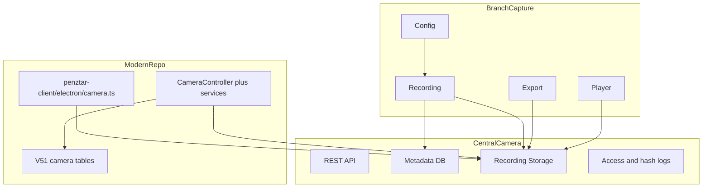

# Camera Subsystem Knowledge Base and Rebuild Plan

> Cel: a kamera alrendszert kulon termekcsaladkent kezelni, nem pusztan egy admin oldalkent.

---

## S1 LEGACY_TERKEP

| Terulet | Szerep |
|---------|--------|
| `Anti/camera` | telepitok, setup, player binarisok |
| `Anti/camera2/camera` | Maven multi-module rendszer: office, center, config, common, inspecter, restorer |
| `Anti/camera3/old` | regi kliensek, citysim, inspecter, OCR/QR, remote sync, server manager |
| `_extracted_auto/camera*` | kicsomagolt telepitok, MariaDB/MySQL runtime, csomagolt deploy anyag |

---

## S2 FO_MODULOK

| Modul | Feladat |
|-------|---------|
| `camera-office` | branch oldali desktop rogzites, player, export, inspection, log, settings |
| `camera-config` | lokalis konfiguracio JavaFX UI |
| `camera-center` | Spring Boot kozponti szerver/REST/mail |
| `camera-cmn` | kozosen hasznalt JavaFX helper-ek |
| `camera-film-inspecter` | dedikalt vizsgalo eszkoz |
| `camera-film-restorer` | hibas film/allomany helyreallito eszkoz |
| `camera3 old clients` | remote sync, citysim, nav/wu segedalkalmazasok |
| modern backend camera stack | metadata, upload, export, access log, transaction-link |
| modern electron camera stack | helyi tarolas, export USB-re, RTSP rogzitok, titkositas |

---

## S3 ARCHITEKTURA

---

## S4 RUNTIME_ES_TAROLAS

### Legacy

- Windows desktop csomagok
- Java / JavaFX
- OpenIMAJGrabber es hasonlo native bridge-ek
- egyes deploy csomagokban MariaDB/MySQL runtime
- orankenti vagy szegmenselt lokalis fajltar
- legacy dokumentacio szerint 50 napos retention

### Modern repo

- `backend/src/main/resources/db/migration/V51__camera_system_tables.sql`
- `backend/src/main/java/hu/puzzleir/valuta/config/CameraProperties.java`
- `penztar-client/electron/camera.ts`

**Jelenlegi modern allapot**

- `camera_config`
- `camera_recording`
- `camera_transaction_link`
- `camera_access_log`
- local storage path: `C:/valuta/camera`
- retention: `50` nap
- titkositas: `AES/GCM/NoPadding`

---

## S5 FONTOS_LEGACY_VISELKEDES

| Tema | Leiras |
|------|--------|
| dual stream | public/private camera logika kulon folyamkent jelent meg |
| file format | C1/C2 szegmenscsalad, byte-headeres tarolas |
| receipt binding | bizonyos esetekben blokk- vagy receipt-szamhoz kapcsolt kameraanyag |
| export | USB vagy fajlkijeloles alapjan kimentheto anyag |
| maintenance | agressziv retention es storage cleanup |
| roles | kulon inspecter / regional / admin jellegu kamera szerepek |

---

## S6 MODERN_REBUILD_PLAN

### Stage A - Legacy spec stabilization

1. C1/C2 header es fajlspec pontos rogzitese
2. receipt-link contract veglegesitese
3. retention es chain-of-custody szabaly rögzitese

### Stage B - Branch capture platform

1. Electron alap maradjon a branch capture shell
2. USB es RTSP capture adapterek kulon interfesz moge
3. local encrypted segment storage a `C:/valuta/camera` alatt
4. stabil offline metadata queue

### Stage C - Central evidence backend

1. PostgreSQL marad source of truth metadatahoz
2. recording upload, retry, idempotency
3. access log es hash-lanc kotelezo
4. branch/worker/receipt based kereshetoseg

### Stage D - Playback and export

1. web admin playback
2. date-range es receipt-range export
3. role-gated download
4. bizonyiteki audit trail

### Stage E - Legacy desktop decommission

1. JavaFX config/player/inspecter kivaltasa
2. restore tool csak akkor maradjon meg, ha tenyleges archiv migracio kell
3. MariaDB/MySQL deploy csomagokat szuntessuk meg

---

## S7 AJANLOTT_TECHNOLOGIAI_IRANY

| Re teg | Javaslat |
|--------|----------|
| branch recorder | Electron + Node native adapters vagy kulon Windows capture service |
| metadata | Spring Boot + PostgreSQL |
| file storage | local encrypted segments + central object/file storage |
| playback | React admin + streaming endpoint |
| integrity | hash-chain service + access logging |
| export | signed export jobs + audit trail |

---

## S8 NYITOTT_KERDESEK

| Tema | Mi nyitott? |
|------|-------------|
| C1/C2 header | 15 vagy 16 byteos dokumentalt formatum |
| camera2 vs camera3 szerepkor | mennyi funkcionalis overlap van |
| MySQL runtime | mely csomagokban volt tenylegesen hasznalt, es melyekben csak telepito orokseg |
| player format | a modern playback nyers frame-eket vagy mar normalizalt video szegmenseket kezeljen |

---

## S9 REFERENCIAK

- `docs/IMPLEMENTATION_PLAN_CAMERA_AND_RATES.md`
- `docs/ANTI_MASTERPLAN_WORKLOG_2026-03-20.md`
- `docs/knowledge/legacy-reverse-engineering/legacy-binary-functional-index.md`
- `backend/src/main/resources/db/migration/V51__camera_system_tables.sql`
- `backend/src/main/java/hu/puzzleir/valuta/config/CameraProperties.java`
- `penztar-client/electron/camera.ts`
