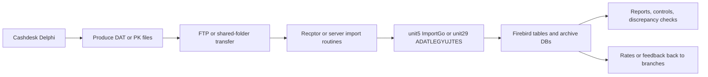

# SZERVER DAT Import Knowledge Base

> Cel: a fajl-alapu legacy adatcseret egy agent-altal is bejarhato import- es adatfolyam-tudastarra bontani.
> Gepi inventory: `generated/szerver-dat-file-families-2026-04-09.csv`

---

## S1 DAT_CSALADOK

| Fajl / pattern | Valoszinu szerep | Megjegyzes |
|----------------|------------------|------------|
| `ARFDATA.DAT` | legacy rates aggregate / publish csomag | modern kommentben is hivatkozott |
| `NR*.DAT` | napi arfolyam fajl | szerver oldali rates terites |
| `RM*.ARF` | rates mellekformatum | parity spec emlites |
| `arfdata.dat` | rates teszt vagy lokalis minta | tobb `arfolyam/verzio*` mappaban is van |
| `ujdata.dat` | uj rates/teszt adat | arfolyam verziok |
| `olddata.dat`, `oldwdata.dat` | elozo rates allapot | verziok/teszt |
| `wdata.dat` | rates segedadat | verziok/teszt |
| `sorszam.dat` | sequence/sorszam fajl | rates vagy import kiserofajl |
| `FOGLALO.DAT` | foglalasi export/allapot | XOR-os legacy formatumkent dokumentalt |
| `data.dat` | makeszlt vagy egyeb export | pontos szovegformatum feltarando |
| `y_curate.dat` | tranzakcios/curation segedadat | `tranzacs` mappa |

---

## S2 FAJLALAPU_ELETUT

### Lepesek

1. A penztar vagy az arfolyam modul fajlt general.
2. A fajl FTP-vel vagy share-en eljut a kozponti szerverhez.
3. A `recptor` vagy a `server` import rutinja felveszi.
4. Firebird tablaba irja vagy osszesiti.
5. Hibat, MNB-elturest, WU/bank/cimlet osszesitest allit elo.
6. Egyes csaladoknal visszafele is kuld adatot a penztaraknak.

---

## S3 PRODUCER_TRANSPORT_IMPORT_DB_MATRIX

| Producer | Transport | Consumer | Cel DB/tablak | Modern megfelelo |
|----------|-----------|----------|---------------|------------------|
| `ARFOLYAM` | FTP | `getarf`, `server`, rates import | `ARFOLYAM`, `MNB`, `NARF*` | `RateFileParserService`, `RateCreationService`, `ExchangeRateController` |
| cashdesk napzaro | FTP -> `C:\RECEPTOR\IRODAxxx\` | `server/unit5.pas` | `BLOKKFEJ`, `BLOKKTETEL`, `DAYBOOK`, `SALLOMANY`, `SBANKFORG` | SyncEngine + REST backend |
| cashdesk osszesitok | FTP | `unit29.pas` ADATLEGYUJTES | forgalom, cimlet, WU, bank aggregatumok | query + closing + report services |
| `FOGLALO` | fajlalapu | szerver/foglalo import | foglalasi adat | `ReservationService` |
| `makeszlt` | fajlalapu | szamla/receipt import | bizonylat segedadat | receipt/pdf stack |

---

## S4 DELPHI_ANCHOROK

| Horgony | Szerep |
|---------|--------|
| `server/unit1.pas` | startup, DayBook, TegnapControl, menu |
| `server/unit5.pas` | fo import modul (`ImportGo`) |
| `server/unit16.pas` | MNB legyujto |
| `server/unit29.pas` | `ADATLEGYUJTES`, forgalom/cimlet/WU/bank aggregacio |
| `recptor/orecept/unit1.pas` | receptor/adatfogado fo logika |
| `arfolyam/verzio20-22/*` | rates test- es formatumfajlok |

---

## S5 MODERN_ANCHOROK

| Fajl | Miert fontos |
|------|--------------|
| `backend/src/main/java/hu/puzzleir/valuta/service/RateFileParserService.java` | GETARF-szeru szoveges rates import |
| `backend/src/main/java/hu/puzzleir/valuta/service/RateCreationService.java` | kommentben kimondja: legacy `ARFDATA.DAT` + FTP helyett publish pipeline |
| `backend/src/main/java/hu/puzzleir/valuta/service/DailyClosingArchiveService.java` | legacy archive tablacsalad modern lekepzese |
| `penztar-client/electron/sync-engine.ts` | FTP helyett offline queue + REST sync |
| `frontend-react/src/pages/sync/SynchronizationPage.tsx` | operatori szinkron felulet |
| `frontend-react/src/pages/sync/LocalQueuePage.tsx` | local queue allapot |

---

## S6 NYITOTT_BIZONYTALANSAGOK

| Tema | Mi bizonytalan? | Kockazat |
|------|------------------|----------|
| rates formatum | szoveges `;`-elvalasztott vs XOR binaris `DAT` vs `ARFDATA.DAT` | magas |
| `recptor` vs `unit5` | pontos felelosseghatar | kozepes |
| `senddata` | teljes protocol nincs teljesen dokumentalva | magas |
| PK vs DAT | egyes treasury/cashstock csaladok nem `.DAT`, de ugyanabba a folyamatba tartoznak | kozepes |
| valutakod-lista | legacy dokumentumok kozott eltér | kozepes |

---

## S7 MODERNIZACIOS_IRANY

1. A fajlformatumokat tipizalt schema-kent dokumentalni kell.
2. A producer oldalt use-case-ekre kell visszabontani:
   - rates
   - daily closing
   - denomination
   - WU
   - bank
   - reservation
3. A transport reteget nem kell replikalni:
   - FTP helyett REST + outbox + retry
4. A receptor logikat ingest pipeline-ra kell szetszedni:
   - parser
   - validator
   - idempotent importer
   - discrepancy checker
   - archive writer

---

## S8 AJANLOTT_KOVETKEZO_DOKSIK

1. Bajtszintu `ARFDATA.DAT` es `FOGLALO.DAT` formatumlap
2. `recptor` / `ImportGo` folyamatdiagram
3. Firebird import-target tabla katalogus
4. REST replacement matrix a SyncEngine endpointjeivel
