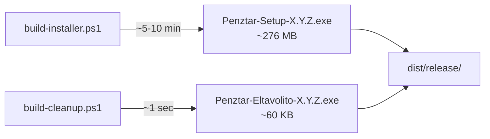

# Áttekintés

Ez a dokumentum a Valutaváltó Pénztár teljes Windows telepítő-build folyamatát írja le, ahogy az v2.3.5-re sikeresen lefutott. Tartalom: (1) build pipeline, (2) verzió-emelési stratégia, (3) tipikus hibák és javításuk, (4) biztonsági alapelvek.

# Quick Reference

```powershell
# 1. Setup EXE (~276 MB, 5-10 min cached)
pwsh -NoLogo -NoProfile -File installer\build-installer.ps1

# 2. Eltávolító EXE (~60 KB, 1 sec)
pwsh -NoLogo -NoProfile -File installer\build-cleanup.ps1
```

A `build-installer.ps1` indítása **automatikusan** lefuttatja a verzió-emelési gate-et (`installer/scripts/check-version-bump.ps1`), ami az **összes 4 verzió-helyet** automatikusan bumpolja, ha a jelenlegi verzió `<=` mint a legutóbbi build EXE.

# 4-way Version Sync

A repo **4 helyen** tartja a verziót, **mind a 4-nek egyeznie kell**:

| Sorrend | Fájl | Szerep |
|---------|------|--------|
| 1 | `package.json` | monorepo root |
| 2 | `frontend-react/package.json` | admin frontend |
| 3 | `penztar-client/package.json` | Electron pénztáros kliens |
| 4 | `backend/pom.xml` | Spring Boot backend Maven artifact |

Forrás: `CLAUDE.md` line 370 + PR #103/#104 (build-common.ps1 dot-source pattern) + PR #177 (CHANGELOG.md release process).

A `check-version-bump.ps1`:
- `npm version patch --no-git-tag-version` x3 (root + frontend-react + penztar-client)
- regex-based pom.xml `<version>` update (top-level only, NEM parent / dependency / plugin)
- drift detection (4 hely nem egyezik → exit 2)
- AUTO-PATCH default mód (current ≤ max(existing) → bump)

# 2-Step Build Pipeline

A `build-installer.ps1` **CSAK a Setup EXE-t** csinálja. Az Eltávolító **KÜLÖN** scripttel készül.



A Setup EXE **MÁR TARTALMAZ** auto-cleanup logikát (`FAZIS 1: Regi telepites cleanup` a `Penztar-Setup.nsi` elején). A standalone Eltávolító **csak akkor szükséges**, ha a Setup auto-cleanup-ja fennakad egy nagyon sérült telepítésen.

# Build Pipeline Belső Működése

`installer/build-installer.ps1` (~340 sor) fázisai:

1. **Verzió-emelő gate** (`scripts/check-version-bump.ps1`) - 4-way sync + auto-patch
2. **Backend Maven build** → `valuta-backend.jar`
3. **Custom JRE jlink** (~50 MB, csak szükséges modulok)
4. **Frontend (React/Vite) + Electron (electron-builder) build**
5. **PostgreSQL 17.5 + NSSM + VC++ Redistributable** letöltés (cached, SHA-256 verified)
6. **Config + scripts staging**
7. **NSIS compile** → egyfájlos `Penztar-Setup-*.exe`

## Build flag-ek gyorsabb újrabuild-hez

```powershell
# Csak NSIS compile (pár másodperc, ha minden stage kész):
pwsh -File installer\build-installer.ps1 -SkipBackendBuild -SkipFrontendBuild -SkipDownloads

# Csak letöltést skip (backend + frontend újrabuild):
pwsh -File installer\build-installer.ps1 -SkipDownloads
```

# Build Gép Előfeltételek

| Komponens | Verzió |
|-----------|--------|
| OS | Windows 10/11 x64 |
| JDK | 21 (backend + jlink) |
| Node.js | 20+ |
| npm | bundled with Node |
| Maven | via `backend/mvnw.cmd` |
| NSIS | 3.x (`C:\Program Files (x86)\NSIS\makensis.exe`) |
| PowerShell | **pwsh (PS7+)** ajánlott, WinPS 5.1 caveats-szel működik |

# Tipikus Hibák és Javításuk

## 1. PostgreSQL ZIP cache CHECKSUM MISMATCH

**Tünet:**
```
Expected: 795196DF1B2855FD0C7FB52629C6CC16ACAA85819912E732BD4C46863E77EB30
Actual:   46903BB56BB0A40A81768703FA7420F0690095685DA040BED2C584B900A1124C
```

**Javítás:**
```powershell
Remove-Item installer\build\downloads\postgresql-binaries.zip -Force
# A következő build automatikusan letölti újra
```

## 2. PostgreSQL letöltés "ResponseEnded prematurely"

`Invoke-WebRequest` nagy fájloknál instabil. **Curl-lel resume-os letöltés**:

```powershell
cd installer\build\downloads
curl.exe -L -o postgresql-binaries.zip --retry 5 --retry-delay 5 --connect-timeout 30 --progress-bar 'https://get.enterprisedb.com/postgresql/postgresql-17.5-1-windows-x64-binaries.zip'
```

## 3. WinPS 5.1 `[version]` operator caching bug

**Tünet:** `check-version-bump.ps1` bumpol amikor nem kéne (WinPS 5.1).

**Javítás:** `[version]::Parse().CompareTo()` használata `-le` helyett. A `check-version-bump.ps1` már kezeli.

## 4. `.claude/worktrees/**` scope pollution

**Tünet:** git commit 28000+ fájlt tartalmaz (Cursor IDE worktree-k).

**Javítás:** `.gitignore`-ban legyen:
```
.claude/worktrees/
.worktrees/
```

## 5. NSIS encoding error

**Tünet:** `Penztar-Setup.nsi` nem fordul (mojibake).

**Javítás:** `.nsi` fájl Windows-1252 ASCII kell legyen. Ékezetek tilos. Em-dash (`—`) → sima `-`.

# Adatbázis-Védelem (KRITIKUS)

A v2.3.0 PR #222 fix-elte a frissítéskori DB-törlést:

- `$UPGRADE_MODE` flag a `Penztar-Setup.nsi` `.onInit`-ben
- `SetRegView 64` lookup a `Wow6432Node` redirect handlinghez
- Conditional `RMDir /r` a `C:\ProgramData\BestChange`-en

**Frissítés** = adatbázis és konfiguráció **megőrizve**.
**Tiszta install** = teljes törlés (nincs DB, ami megmaradjon).
**Standalone Eltávolító** = TÖRLI a `C:\ProgramData\BestChange`-et, **beleértve az adatbázist**! Ha az adatbázist meg akarjuk őrizni, **`pg_dump` kötelező** előtte.

# Security Posture

| Réteg | Védelem |
|-------|---------|
| Bundled deps | SHA-256 checksum verified build-time (PG, NSSM, VC++) |
| PostgreSQL auth | `scram-sha-256` (postgres superuser is random jelszó) |
| Config ACL | `C:\ProgramData\BestChange\config\` inheritance off, csak SYSTEM + Admins + service user |
| `.env` | `0o600` jogokkal + atomic rename |
| Tűzfal | localhost-only (127.0.0.1), portok 8080 + 54320 |
| Secrets | Helyben generált random (JWT, encryption, PG passwords) — **nincs beégetett credential a EXE-ben** |

# Release Bundle (`dist/release/`)

```
dist/release/
├── Penztar-Setup-X.Y.Z-YYYYMMDD.exe          (276 MB, gitignored)
├── Penztar-Eltavolito-X.Y.Z-YYYYMMDD.exe     (60 KB, gitignored)
├── Penztar-Setup-X.Y.Z-YYYYMMDD.exe.sha256
├── Penztar-Eltavolito-X.Y.Z-YYYYMMDD.exe.sha256
├── build-info.json                            (machine-readable metadata)
└── install-notes.md                           (human-readable guide)
```

A binary EXE-k **gitignored** (276 MB nem mehet repo-ba). GitHub Release-en publikálva.

# Evidence: v2.3.5 Build (2026-04-27)

| Artifact | SHA256 |
|----------|--------|
| `Penztar-Setup-2.3.5-20260427.exe` | `9D79DEEDC030FC6FA4B2F438571F8D481E753EB5494C46F79D268A47329DD25D` |
| `Penztar-Eltavolito-2.3.5-20260427.exe` | `53683D9D48732CD4FBF9B7C2D590469A298460B24708D365193050B569D6B029` |

Git commit: `e1121a30` (release(v2.3.5): 4-way version sync + dist/release artifact bundle)

Eszter F2 review: BLOCKER → APPROVED (minden finding javítva).

# Lessons Learned

1. **Olvasd el a CLAUDE.md-t ELŐSZÖR** — a 4-way version sync + 2-step build már dokumentálva volt (line 370).
2. **Ne találj fel kereket** — `npm version patch --no-git-tag-version` az ipar-szabvány, nem custom regex.
3. **WinPS 5.1 vs pwsh** — `[version]` operator-precedence különböző. `[version]::Parse().CompareTo()` cross-version safe.
4. **Eszter review BLOCKER** = `.claude/worktrees/**` scope pollution. **Mindig `.gitignore`-ban legyen!**
5. **Build cache corruption** — PG ZIP regen lehet. Töröld + `curl.exe`-vel újra.
6. **Soft reset + clean recommit** — `git reset --soft N^` + tiszta staging.

# Kapcsolódó Fájlok

- `installer/README.md` — részletes installer-fejlesztő dokumentáció
- `CLAUDE.md` line 370 — `build-common.ps1` dot-source pattern (PR #103/#104)
- `CHANGELOG.md` — release notes (4-way version bump v2.2.3 PR #177)
- `docs/knowledge/installer-wizard-implementation-guide.md` — SetupWizard kontextus
- `installer/Penztar-Setup.nsi` (1040 sor) + `installer/Penztar-Cleanup.nsi` (130 sor)
- `installer/tests/installer-validation-suite.ps1` — 30K bytes, 5-textbook validation suite
- `.claude/skills/installer-build/SKILL.md` — agent skill a gyors build-hez
