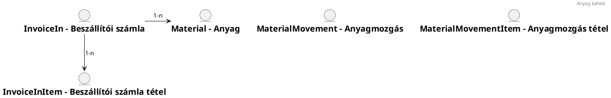
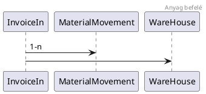

# bgs.figdoc.md

**Kategoria:** altalanos  |  **Tipus:** text  |  **Meret:** 22.4 KB
**Eredeti utvonal:** `Felmérés/Valuta/v2.0/Markdown/bgs.figdoc.md`

## Tartalom

# Specifikáció

## Folyamatok





## Változtatások

| Verzió/Dátum     | Leírás      |
|------------------|-------------|
| 1.0 - 2024.11.27 | Első verzió |

### Entitások

### FIGDEF# worksheet

```yaml
    label: Munkalap
    pluralLabel: Munkalapok
    type: TABLE
```

| Field                | Label            | Type     | Size | Decimals | Nullable | Unique | AutoIncr. | Description | FT    | Foreign          | FK          | Hide |
|----------------------|------------------|----------|------|----------|----------|--------|-----------|-------------|-------|------------------|-------------|------|
| id                   | Id               | IDENT    |      |          |          |        |           |             |       |                  |             |      |
| code                 | Kód              | VARCHAR  | 64   |          |          |        |           |             |       |                  |             |      |
| partner_id           | Partner          | FKIDENT  |      |          | X        |        |           |             | TABLE | partner          | partner.id  |      |
| inst_loc_id          | Telepítési hely  | FKIDENT  |      |          | X        |        |           |             | TABLE | inst_loc         | inst_loc.id |      |
| project_id           | Projekt          | FKIDENT  |      |          | X        |        |           |             | TABLE | project          | project.id  |      |
| name                 | Név              | VARCHAR  | 1024 |          | X        |        |           |             |       |                  |             |      |
| description          | Leírás           | VARCHAR  | 2000 |          | X        |        |           |             |       |                  |             |      |
| worksheet_status_did | Munkalap státusz | DICT     |      |          | X        |        |           |             |       | WORKSHEET_STATUS |             |      |
| worksheet_open_date  | Munkalap dátuma  | DATE     |      |          |          |        |           |             |       |                  |             |      |
| open_worker_id       | Munkalap nyitó   | FKIDENT  |      |          |          |        |           |             | TABLE | worker           | worker.id   |      |
| worksheet_begin      | Munkalap kezdete | DATETIME |      |          |          |        |           |             |       |                  |             |      |
| worksheet_end        | Munkalap vége    | DATETIME |      |          | X        |        |           |             |       |                  |             |      |
| occasional_flag      | Eseti            | BOOL     |      |          | X        |        |           |             |       |                  |             |      |
| worksheet_close_date | Lezárás dátuma   | DATE     |      |          | X        |        |           |             |       |                  |             |      |
| close_worker_id      | Munkalap lezáró  | FKIDENT  |      |          | X        |        |           |             | TABLE | worker           | worker.id   |      |

---

### FIGDEF# worksheet_ext

```yaml
    label: Munkalap
    pluralLabel: Munkalapok
    type: EXTEND
    parent: worksheet
```

| Field            | Label            | Type       | Size | Decimals | Nullable | Unique | AutoIncr. | Description | FT     | Foreign          | FK               | Replacement          | Hide |
|------------------|------------------|------------|------|----------|----------|--------|-----------|-------------|--------|------------------|------------------|----------------------|------|
| partner          | Partner          | Partner    |      |          | X        |        |           |             | DTO    | partner          | name             | partner_id           |      |
| inst_loc         | Telepítési hely  | InstLoc    |      |          | X        |        |           |             | DTO    | inst_loc         | name             | inst_loc_id          |      |
| project          | Projekt          | Project    |      |          | X        |        |           |             | DTO    | project          | name             | project_id           |      |
| worksheet_status | Munkalap státusz | Dictionary |      |          |          |        |           |             | DICT   | WORKSHEET_STATUS | description      | worksheet_status_did |      |
| open_worker_ext  | Munkalap nyitó   | WorkerExt  |      |          |          |        |           |             | EXTEND | worker_ext       | person.last_name | open_worker_id       |      |
| close_worker_ext | Munkalap lezáró  | WorkerExt  |      |          | X        |        |           |             | EXTEND | worker_ext       | person.last_name | close_worker_id      |      |

---

### FIGDEF# worksheet_worker

```yaml
    label: Munkalap résztvevő
    pluralLabel: Munkalap résztvevői
    type: TABLE
```

| Field           | Label               | Type     | Size | Decimals | Nullable | Unique | AutoIncr. | Description | FT    | Foreign   | FK           | Hide |
|-----------------|---------------------|----------|------|----------|----------|--------|-----------|-------------|-------|-----------|--------------|------|
| id              | Id                  | IDENT    |      |          |          |        |           |             |       |           |              |      |
| worksheet_id    | Munkalap            | FKIDENT  |      |          |          |        |           |             | TABLE | worksheet | worksheet.id | X    |
| worker_id       | Résztvevő           | FKIDENT  |      |          |          |        |           |             | TABLE | worker    | worker.id    |      |
| work_begin      | Munkavégzés kezdete | DATETIME |      |          |          |        |           |             |       |           |              |      |
| work_end        | Munkavégzés vége    | DATETIME |      |          |          |        |           |             |       |           |              |      |
| work_time       | Munkaidő            | DECIMAL  | 19   | 2        |          |        |           |             |       |           |              |      |
| completed_tasks | Elvégzett feladatok | VARCHAR  | 2000 |          |          |        |           |             |       |           |              |      |
| note            | Megjegyzés          | VARCHAR  | 2000 |          | X        |        |           |             |       |           |              |      |
| status_did      | Státusz             | DICT     |      |          | X        |        |           |             |       | STATUS    |              |      |

---

### FIGDEF# worksheet_worker_ext

```yaml
    label: Munkalap résztvevő
    pluralLabel: Munkalap résztvevői
    type: EXTEND
    parent: worksheet_worker
```

| Field      | Label     | Type       | Size | Decimals | Nullable | Unique | AutoIncr. | Description | FT     | Foreign    | FK               | Replacement  |
|------------|-----------|------------|------|----------|----------|--------|-----------|-------------|--------|------------|------------------|--------------|
| worksheet  | Munkalap  | Worksheet  |      |          |          |        |           |             | DTO    | worksheet  | name             | worksheet_id |
| worker_ext | Résztvevő | WorkerExt  |      |          |          |        |           |             | EXTEND | worker_ext | person.last_name | worker_id    |
| status     | Státusz   | Dictionary |      |          | X        |        |           |             | DICT   | STATUS     | description      | status_did   |

---

### FIGDEF# worksheet_material

```yaml
    label: Munkalap anyag
    pluralLabel: Munkalap anyagai
    type: TABLE
```

| Field               | Label         | Type    | Size | Decimals | Nullable | Unique | AutoIncr. | Description | FT    | Foreign         | FK           | Hide | SubType  |
|---------------------|---------------|---------|------|----------|----------|--------|-----------|-------------|-------|-----------------|--------------|------|----------|
| id                  | Id            | IDENT   |      |          |          |        |           |             |       |                 |              |      |          |
| material_use_did    | Tétel jellege | DICT    |      |          | X        |        |           |             |       | MATERIAL_USE    |              |      |          |
| worksheet_id        | Munkalap      | FKIDENT |      |          |          |        |           |             | TABLE | worksheet       | worksheet.id | X    |          |
| material_id         | Anyag         | FKIDENT |      |          | X        |        |           |             | TABLE | material        | material.id  |      |          |
| quantity            | Mennyiség     | DECIMAL | 19   | 2        |          |        |           |             |       |                 |              |      | CURRENCY |
| unit_of_measure_did | Mértékegység  | DICT    |      |          |          |        |           |             |       | UNIT_OF_MEASURE |              |      |          | 
| material_reason_did | Indoklás      | DICT    |      |          | X        |        |           |             |       | MATERIAL_REASON |              |      |          |
| note                | Megjegyzés    | VARCHAR | 2000 |          | X        |        |           |             |       |                 |              |      |          |
| sold_flag           | Eladott       | BOOL    |      |          | X        |        |           |             |       |                 |              |      |          |
| status_did          | Státusz       | DICT    |      |          | X        |        |           |             |       | STATUS          |              |      |          |

---

### FIGDEF# worksheet_material_ext

```yaml
    label: Munkalap anyag
    pluralLabel: Munkalap anyagai
    type: EXTEND
    parent: worksheet_material
```

| Field           | Label         | Type       | Size | Decimals | Nullable | Unique | AutoIncr. | Description | FT   | Foreign         | FK          | Replacement         | Hide |
|-----------------|---------------|------------|------|----------|----------|--------|-----------|-------------|------|-----------------|-------------|---------------------|------|
| material_use    | Tétel jellege | Dictionary |      |          |          |        |           |             | DICT | MATERIAL_USE    | description | material_use_did    |      |
| worksheet       | Munkalap      | Worksheet  |      |          |          |        |           |             | DTO  | worksheet       | name        | worksheet_id        | X    |
| material        | Anyag         | Material   |      |          |          |        |           |             | DTO  | material        | name        | material_id         |      |
| material_reason | Indoklás      | Dictionary |      |          | X        |        |           |             | DICT | MATERIAL_REASON | description | material_reason_did |      |
| status          | Státusz       | Dictionary |      |          | X        |        |           |             | DICT | STATUS          | description | status_did          |      |
| unit_of_measure | Mértékegység  | Dictionary |      |          |          |        |           |             | DICT | UNIT_OF_MEASURE | description | unit_of_measure_did |      |

---

### FIGDEF# worksheet_document

```yaml
    label: Munkalap dokumentum
    pluralLabel: Munkalap dokumentumok
    type: TABLE
```

| Field        | Label      | Type    | Size | Decimals | Nullable | Unique | AutoIncr. | Description | FT    | Foreign   | FK           |
|--------------|------------|---------|------|----------|----------|--------|-----------|-------------|-------|-----------|--------------|
| id           | Id         | IDENT   |      |          |          |        |           |             |       |           |              |
| worksheet_id | Termék     | FKIDENT |      |          |          |        |           |             | TABLE | worksheet | worksheet.id |
| document_id  | Dokumentum | FKIDENT |      |          |          |        |           |             | TABLE | document  | document.id  |

---

### FIGDEF# worksheet_document_ext

```yaml
    label: Munkalap dokumentum
    pluralLabel: Munkalap dokumentumok
    type: EXTEND
    parent: worksheet_document
```

| Field    | Label      | Type        | Size | Decimals | Nullable | Unique | AutoIncr. | Description | FT     | Foreign      | FK   | Replacement |
|----------|------------|-------------|------|----------|----------|--------|-----------|-------------|--------|--------------|------|-------------|
| document | Dokumentum | DocumentExt |      |          |          |        |           |             | EXTEND | document_ext | name | document_id |

---

### FIGDEF# closure

```yaml
    label: Elszámolás
    pluralLabel: Elszámolások
    type: TABLE
```

| Field              | Label              | Type    | Size | Decimals | Nullable | Unique | AutoIncr. | Description | FT    | Foreign        | FK             | SubType  |
|--------------------|--------------------|---------|------|----------|----------|--------|-----------|-------------|-------|----------------|----------------|----------|
| id                 | Id                 | IDENT   |      |          |          |        |           |             |       |                |                |          |
| partner_id         | Partner            | FKIDENT |      |          |          |        |           |             | TABLE | partner        | partner.id     |          |     
| inst_loc_id        | Telepítési hely    | FKIDENT |      |          | X        |        |           |             | TABLE | inst_loc       | inst_loc.id    |          |    
| project_id         | Projekt            | FKIDENT |      |          | X        |        |           |             | TABLE | project        | project.id     |          |
| closure_date       | Elszámolás dátuma  | DATE    |      |          |          |        |           |             |       |                |                |          |
| closure_status_did | Elszámolás státusz | DICT    |      |          |          |        |           |             |       | CLOSURE_STATUS |                |          |
| invoice_out_id     | Számla             | FKIDENT |      |          | X        |        |           |             | TABLE | invoice_out    | invoice_out.id |          |
| margin             | Árrés              | DECIMAL | 19   | 2        | X        |        |           |             |       |                |                | PERCENT  |      
| hourly_rate        | Óradíj             | DECIMAL | 19   | 2        | X        |        |           |             |       |                |                | CURRENCY |
| distance_fee       | Távolsági díj      | DECIMAL | 19   | 2        | X        |        |           |             |       |                |                | CURRENCY |
| departure_fee      | Kiszállási díj     | DECIMAL | 19   | 2        | X        |        |           |             |       |                |                | CURRENCY |

---

### FIGDEF# closure_ext

```yaml
    label: Elszámolás
    pluralLabel: Elszámolások
    type: EXTEND
    parent: closure
```

| Field          | Label              | Type       | Size | Decimals | Nullable | Unique | AutoIncr. | Description | FT   | Foreign        | FK          | Replacement        |
|----------------|--------------------|------------|------|----------|----------|--------|-----------|-------------|------|----------------|-------------|--------------------|
| partner        | Partner            | Partner    |      |          | X        |        |           |             | DTO  | partner        | name        | partner_id         |      
| inst_loc       | Telepítési hely    | InstLoc    |      |          | X        |        |           |             | DTO  | inst_loc       | name        | inst_loc_id        |     
| project        | Projekt            | Project    |      |          |          |        |           |             | DTO  | project        | name        | project_id         |
| closure_status | Elszámolás státusz | Dictionary |      |          |          |        |           |             | DICT | CLOSURE_STATUS | description | closure_status_did |
| invoice_out    | Számla             | InvoiceOut |      |          | X        |        |           |             | DTO  | invoice_out    | invoice_no  | invoice_out_id     |

---

### FIGDEF# closure_from_menu_ext

```yaml
    label: Elszámolás
    pluralLabel: Elszámolások
    type: EXTEND
    parent: closure
```

| Field          | Label              | Type       | Size | Decimals | Nullable | Unique | AutoIncr. | Description | FT   | Foreign        | FK          | Replacement        | Hide |
|----------------|--------------------|------------|------|----------|----------|--------|-----------|-------------|------|----------------|-------------|--------------------|------|
| partner        | Partner            | Partner    |      |          | X        |        |           |             | DTO  | partner        | name        | partner_id         |      |
| inst_loc       | Telepítési hely    | InstLoc    |      |          | X        |        |           |             | DTO  | inst_loc       | name        | inst_loc_id        |      |
| project        | Projekt            | Project    |      |          |          |        |           |             | DTO  | project        | name        | project_id         |      |
| closure_status | Elszámolás státusz | Dictionary |      |          |          |        |           |             | DICT | CLOSURE_STATUS | description | closure_status_did |      |
| invoice_out    | Számla             | InvoiceOut |      |          | X        |        |           |             | DTO  | invoice_out    | invoice_no  | invoice_out_id     |      |

---

### FIGDEF# closure_item

```yaml
    label: Elszámolás tétel
    pluralLabel: Elszámolás tételei
    type: TABLE
```

| Field                 | Label              | Type    | Size | Decimals | Nullable | Unique | AutoIncr. | Description | FT    | Foreign           | FK                  | SubType  |
|-----------------------|--------------------|---------|------|----------|----------|--------|-----------|-------------|-------|-------------------|---------------------|----------|
| id                    | Id                 | IDENT   |      |          |          |        |           |             |       |                   |                     |          |
| closure_id            | Elszámolás         | FKIDENT |      |          |          |        |           |             | TABLE | closure           | closure.id          |          |
| worksheet_id          | Munkalap           | FKIDENT |      |          |          |        |           |             | TABLE | worksheet         | worksheet.id        |          |
| closure_item_type_did | Tétel típus        | DICT    |      |          |          |        |           |             |       | CLOSURE_ITEM_TYPE |                     |          |
| worksheet_worker_id   | Munkalap résztvevő | FKIDENT |      |          | X        |        |           |             | TABLE | worker            | worker.id           |          |
| worksheet_material_id | Munkalap anyag     | FKIDENT |      |          | X        |        |           |             | TABLE | material          | material.id         |          |
| price                 | Ár                 | DECIMAL | 19   | 2        |          |        |           |             |       |                   |                     | CURRENCY |
| currency_did          | Pénznem            | DICT    |      |          |          |        |           |             |       | CURRENCY          |                     |          |
| invoice_out_item_id   | Számla tétel       | FKIDENT |      |          | X        |        |           |             | TABLE | invoice_out_item  | invoice_out_item.id |          |

---

### FIGDEF# closure_item_ext

```yaml
    label: Elszámolás tétel
    pluralLabel: Elszámolás tételei
    type: EXTEND
    parent: closure_item
```

| Field              | Label              | Type           | Size | Decimals | Nullable | Unique | AutoIncr. | Description | FT     | Foreign           | FK               | Replacement           |
|--------------------|--------------------|----------------|------|----------|----------|--------|-----------|-------------|--------|-------------------|------------------|-----------------------|
| worksheet          | Munkalap           | Worksheet      |      |          | X        |        |           |             | DTO    | worksheet         | name             | worksheet_id          |
| closure_item_type  | Tétel típus        | Dictionary     |      |          |          |        |           |             | DICT   | CLOSURE_ITEM_TYPE | description      | closure_item_type_did |
| worksheet_worker   | Munkalap résztvevő | WorkerExt      |      |          | X        |        |           |             | EXTEND | worker_ext        | person.last_name | worksheet_worker_id   |
| worksheet_material | Munkalap anyag     | Material       |      |          | X        |        |           |             | DTO    | material          | name             | worksheet_material_id |
| currency           | Pénznem            | Dictionary     |      |          |          |        |           |             | DICT   | CURRENCY          | description      | currency_did          |
| invoice_out_item   | Számla tétel       | InvoiceOutItem |      |          | X        |        |           |             | DTO    | invoice_out_item  | invoice_no       | invoice_out_item_id   |
