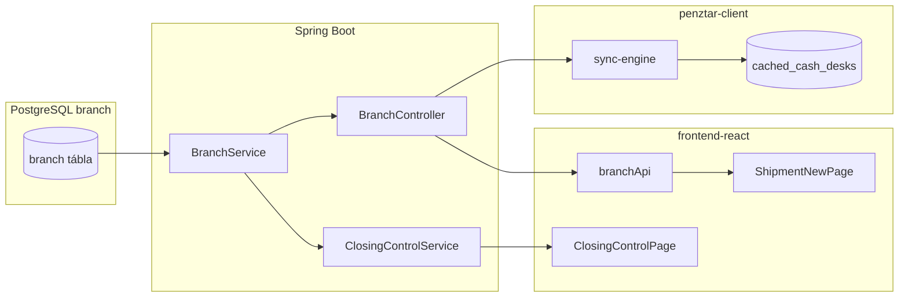

<!-- AGENT-HEAD -->

## AGENT-HEAD — olvasd először

**Feladat típusa:** feltérképezés és dokumentálás. **TILOS programozni** ebből a fájlból indulva, amíg a kolléga nem ad külön implementációs megbízást.

**Cél:** A Központi Munkaállomás **Pénztár Törzs Adatbázis** alapmoduljának (65 pénztár + 8 értéktár irodaadatai: név, cím, bankkód, szolgáltatások, státusz stb.) teljes adat- és kapcsolat-térképe. Ez az alapmodul lesz — az átadás-átvételi listák, zárás-beérkezés, készlet-kimutatások és értéktári program innen hív majd naprakész irodaadatot.

**Forrás-kérdések (4 db):** az eredeti `FELTERKEPEZES_penztar_torzs.md` fájlban — mindegyikre alább **kódból igazolt válasz** van.

**Következő lépés az ügynöknek:** Fázis 1–4 végrehajtása → `FELTERKEPEZES_EREDMENY.md` összefoglaló (max 2 oldal) a kollégának.

### TILOS

- Mezőket, endpointokat vagy táblákat kitalálni dokumentációból — csak a repo aktuális kódja és migrációi számítanak.
- A `BranchPage` létezéséből azt feltételezni, hogy elérhető a UI-ban (jelenleg **nincs route** regisztrálva).
- A `PublicBranchDto`-t bővíteni „feltérképezés közben” — az szándékosan szűkített, pre-login wizardhoz.
- Flyway migrációt írni V293 mezőkre — **már létezik** `V293__branch_master_service_flags.sql`.

### DO

- Minden állítást fájlútvonallal és (ahol lehet) sorhivatkozással igazolj.
- A feltérképezés eredményét **táblázat + fájllista + hiánylista** formában add vissza.
- Külön jelöld: **már összekötve** vs **részben összekötve** vs **hiányzik**.

<!-- /AGENT-HEAD -->

---

## 1. Kontextus — mi a Pénztár Törzs ebben a repóban?

| Fogalom | Repo-beli megfelelő | Bizonyíték |
|---|---|---|
| Iroda / pénztár / értéktár törzsrekord | PostgreSQL `branch` tábla + JPA `Branch` entitás | `backend/.../entity/Branch.java` |
| Cég-szintű izoláció | `company_id` minden branch soron | `Branch.java` `@JoinColumn company_id` |
| Értéktár vs pénztár | `is_vault` boolean | `V174__b6_branch_is_vault_flag.sql`, `Branch.java` |
| Szolgáltatás-flagek (ÁFA, WU, MG, POS) | `has_afa`, `has_wu`, `has_mg`, `has_pos` | `V293__branch_master_service_flags.sql` |
| Nyitvatartás (hétvége) | `closed_saturday`, `closed_sunday` | ugyanaz |
| Rövid név | `short_name` | ugyanaz |
| REST API | `/api/v1/branches/**` | `BranchController.java` |
| Frontend API kliens | `branchApi` | `frontend-react/src/services/api/settings.ts` |

**Következtetés:** Nincs külön „Pénztár Törzs” tábla — a meglévő `branch` entitás **az** alapmodul. A fejlesztési feladat főleg: UI elérhetőség, fogyasztók bekötése, offline cache bővítése (ahol szükséges).

---

## 2. Válaszok a forrás-fájl 4 kérdésére (kódból)

### 2.1 Jelenlegi adattárolás

**Hol van az iroda/pénztár adat?**

- **Egyetlen kanonikus tábla:** PostgreSQL `branch` (Flyway: `V0_1__base_tables.sql` alap séma, későbbi migrációk bővítik).
- **JPA entitás:** `hu.puzzleir.valuta.entity.Branch`.
- **Nincs** párhuzamos „office” vagy „penztar_torzs” entitás.

**Már létező mezők (a forrás táblázatához képest):**

| Forrás mező | DB oszlop | Entitás mező | Állapot |
|---|---|---|---|
| `short_name` | `short_name` | `shortName` | ✅ V293 |
| `phone` | `phone` | `phone` | ✅ V0_1 óta |
| `email` | `email` | `email` | ✅ V0_1 óta |
| `bank_code` | `bank_code` | `bankCode` | ✅ V0_1 óta (NOT NULL) |
| `has_afa` | `has_afa` | `hasAfa` | ✅ V293 |
| `has_wu` | `has_wu` | `hasWu` | ✅ V293 |
| `has_mg` | `has_mg` | `hasMg` | ✅ V293 |
| `has_pos` | `has_pos` | `hasPos` | ✅ V293 |
| `closed_saturday` | `closed_saturday` | `closedSaturday` | ✅ V293 |
| `closed_sunday` | `closed_sunday` | `closedSunday` | ✅ V293 |
| `is_vault` | `is_vault` | `isVault` | ✅ V174 |

**További, már létező branch mezők (alapmodul-szempontból fontosak):**

- `code`, `name`, `address`, `city`, `zip_code` — cím és azonosítás
- `branch_type_did` — dictionary (pl. `PENZTAR`, `VAULT_COUNTERPARTY`)
- `branch_status_did` — státusz dictionary
- `is_active` — soft delete / inaktiválás
- `region`, `region_code` — területi csoportosítás (Országos készlet, scope)
- `vault_territory_id` — értéktári terület hozzárendelés
- `parent_branch_id` — hierarchia
- `opening_date`, `denomination_rule_id`

### 2.2 Bővíthetőség (Flyway, zero-downtime)

**A forrás-fájlban felsorolt új mezők:** a repo **már tartalmazza** a `V293__branch_master_service_flags.sql` migrációt.

Migráció jellemzői (kódból):

- `ADD COLUMN IF NOT EXISTS` — idempotens
- Szolgáltatás-flagek: `NOT NULL DEFAULT FALSE` — meglévő sorok azonnal FALSE
- `short_name`: nullable `VARCHAR(100)`
- A migráció kommentje szerint: ~40 modul hivatkozik Branch-re, de **egyik sem olvassa** ezeket az új oszlopokat → visszafelé kompatibilis

**Backend DTO/Mapper/Service lánc V293-ra:**

| Réteg | Fájl | V293 mezők |
|---|---|---|
| Response DTO | `BranchDto.java` | `shortName`, `hasAfa`, `hasWu`, `hasMg`, `hasPos`, `closedSaturday`, `closedSunday` |
| Create DTO | `CreateBranchDto.java` | ugyanezek (opcionális) |
| Update DTO | `UpdateBranchDto.java` | ugyanezek (partial update) |
| Mapper | `BranchMapper.java` | entity ↔ DTO mapping kész |
| Service | `BranchService.java` | create/update null-guard + default FALSE |

**Teendő feltérképezéskor:** ellenőrizni, hogy a cél környezetben a Flyway `V293` **lefutott-e** (nem a kódban van-e — az már benne van).

### 2.3 Meglévő API végpontok

**Fő controller:** `BranchController` — `@RequestMapping("/api/v1/branches")`, `@PreAuthorize("isAuthenticated()")`

| Metódus | Útvonal | Funkció | RBAC |
|---|---|---|---|
| GET | `/api/v1/branches` | Lista (type/status/search/activeOnly/clientType szűrők) | authenticated |
| GET | `/api/v1/branches/my-territory` | Területileg szűrt aktív fiókok (FK-005/B4) | authenticated |
| GET | `/api/v1/branches/cashier-shipment-targets` | Pénztári átadás cél irodák (FK-013) | CASHIER/PENZTAR/SUPERVISOR/MANAGER/ADMIN |
| GET | `/api/v1/branches/vault-counterparties` | Értéktári átadás 3 csoport (FK-013) | ADMIN/FOERTEKTAR/UGYVEZETO/ERTEKTAR/MANAGER |
| GET | `/api/v1/branches/vault-only` | Csak értéktárak | authenticated |
| GET | `/api/v1/branches/roots` | Gyökér fiókok | authenticated |
| GET | `/api/v1/branches/{id}` | Egy fiók ID alapján | authenticated |
| GET | `/api/v1/branches/code/{code}` | Egy fiók kód alapján | authenticated |
| GET | `/api/v1/branches/{id}/children` | Gyermekek | authenticated |
| GET | `/api/v1/branches/{id}/path` | Breadcrumb útvonal | authenticated |
| POST | `/api/v1/branches` | Létrehozás | ADMIN/FOERTEKTAR/UGYVEZETO |
| POST | `/api/v1/branches/simple-cashier` | Egyszerűsített pénztár-felrögzítés | ADMIN/FOERTEKTAR/UGYVEZETO/ERTEKTAR |
| PUT | `/api/v1/branches/{id}` | Módosítás | ADMIN/FOERTEKTAR/UGYVEZETO |
| PATCH | `/api/v1/branches/{id}/is-vault` | Értéktár flag | ADMIN/FOERTEKTAR/UGYVEZETO |
| DELETE | `/api/v1/branches/{id}` | Soft delete | ADMIN |

**Kapcsolódó, branch-adatot szolgáltató endpointok:**

| Controller | Útvonal | Cél |
|---|---|---|
| `PublicBranchController` | `GET /api/v1/public/branches?companyCode=&vaultOnly=` | Pre-login Setup Wizard (publikus, szűkített DTO) |
| `PublicBranchController` | `GET /api/v1/public/workers?companyCode=&branchCode=` | Login előtti dolgozó lista régió szerint |
| `BranchGroupController` | `/api/v1/branch-groups/**` | Iroda-csoportok (külön entitás: `BranchGroup`) |
| `ErtektarController` | `GET /api/v1/ertektar/branches` (+ `/status` alias) | Értéktár dashboard — alárendelt pénztár státusz |
| `BranchMonitoringController` | `/api/v1/monitoring/**` | Heartbeat, online/offline, dashboard |
| Rate creation | `/api/v1/rate-creation/branches?workgroupId=` | Árfolyam-munkacsoport iroda-hozzárendelés |

### 2.4 Hivatkozások — ki fogyasztja a Branch törzset?

**Adatbázis szint (JPA entitások `branch_id` / `Branch` kapcsolattal):** legalább **70 entitás** érintett (grep: `backend/.../entity/*.java`). Fontosabb csoportok:

| Modul / domain | Példa entitások |
|---|---|
| Tranzakció / készlet | `Transaction`, `CashBalance`, `InventoryMovement`, `InventorySummary` |
| Zárás | `ClosingControl`, `ClosingWizard`, `NavClosing`, `MonthlyClosing`, `EveningClosing` |
| Dolgozó | `Worker`, `WorkerBranchAccess`, `WorkerSession` |
| Átadás / szállítás | `Transfer`, `ShipmentRequest` |
| Árfolyam | `ExchangeRate`, `RateCategory`, `RateWorkgroup` |
| Western Union / POS | `WuBalance`, `WuTransaction`, `PosTerminal` |
| NAV / riport | `DailyReport`, `DecadeReport`, `MnbReport` |
| Egyéb | `Reservation`, `BankOrder`, `DailySession`, `ReceiptSequence`, … |

**Backend service-ek, amelyek közvetlenül `BranchRepository`-t használnak (minta):**

- `BranchService` — CRUD + területi/counterparty listák
- `ClosingControlService` — zárás-beérkezés irodánként (`findByCompanyIdAndIsActiveTrueExcludingCounterparties`)
- `BranchMonitoringService` — online/offline dashboard
- `AccessScopeService` — értéktári területi scope (`vaultRegionBranchScopeOrNull`)
- `WorkerBranchAccessService` — M:N dolgozó–iroda hozzáférés

**Frontend fogyasztók (`branchApi` vagy közvetlen `/branches`):**

| Oldal / modul | Fájl | Használt API |
|---|---|---|
| Átadás-átvétel (új szállítmány) | `ShipmentNewPage.tsx` | `listVaultCounterparties`, `listCashierShipmentTargets`, `listMyTerritory` |
| Értéktári mozgáskezelő | `MovementManager.tsx` | `listVaultCounterparties` |
| Országos készlet | `CashierStocksPage.tsx` | `listActive` (region meta) |
| Átadások | `TransferPage.tsx` | `listActive` |
| Napi napló / riportok | `DailyJournalPage.tsx`, `HandlingFeeDecadePage.tsx`, stb. | `listActive` |
| Kamera export | `CameraExportPage.tsx` | `listActive` |
| Új pénztár felrögzítés | `NewCashierBranchPage.tsx` | `createSimpleCashier` |
| Western Union | `WesternUnionPage.tsx` | `GET /branches` (közvetlen) |
| Zárás-beérkezés | `ClosingControlPage.tsx` | `closingControlApi` (backend: Branch adatok a `ClosingControlService`-ből) |
| Setup Wizard | `SetupWizard.tsx` | `GET /public/branches` (publikus) |

**Electron / offline réteg (`penztar-client`):**

| Komponens | Endpoint / tároló | Cache-elt mezők |
|---|---|---|
| `sync-engine.ts` → `syncCashDeskMasterData()` | `GET /branches?activeOnly=true` | SQLite `cached_cash_desks`: id, code, name, company_id, city, is_active |
| `sync-engine.ts` → branch status sync | `GET /ertektar/branches/status` | SQLite `cached_branch_status` (operatív státusz, nem törzs) |
| `first-run.ts` | `GET /public/branches?companyCode=` | Setup Wizard választó (nem perzisztált teljes törzs) |
| `main.js` / `sqlite.ts` | — | `cached_workers.branch_id/code/name` — dolgozó→iroda kapcsolat |

---

## 3. Mi van MÁR megfelelően összekapcsolva?

Az alábbi táblázat **kódból igazolt**, működő adatfolyamok. Ezekre a Pénztár Törzs alapmodul épülhet — módosítás nélkül is használhatók listázásra és azonosításra.

### 3.1 Adatbázis ↔ Backend

| Kapcsolat | Állapot | Bizonyíték |
|---|---|---|
| PostgreSQL `branch` ↔ JPA `Branch` | ✅ Teljes | `Branch.java` ↔ `V0_1` + migrációk |
| V293 szolgáltatás mezők ↔ entitás | ✅ | `Branch.java` 109–142. sor |
| Entitás ↔ `BranchDto` | ✅ | `BranchMapper.java` |
| Create/Update DTO ↔ Service | ✅ | `CreateBranchDto`, `UpdateBranchDto`, `BranchService.create/update` |
| Multi-tenant (`companyId`) | ✅ | `BranchService.findAll/findAllActive` — `SecurityUtils.getCurrentCompanyId()` |
| Új branch → kassza init | ✅ | `BranchService` → `CashBalanceService` + `DenominationService` (Issue #110, B3) |

### 3.2 Backend ↔ Frontend API (REST)

| Wire | Állapot | Bizonyíték |
|---|---|---|
| `GET/POST/PUT/DELETE /branches` | ✅ | `BranchController` + axios `api` (`/api/v1` prefix) |
| `branchApi.list / listActive / listMyTerritory` | ✅ | `settings.ts` 54–70. sor |
| `branchApi.listVaultCounterparties` | ✅ | FK-013, `settings.ts` 89–99. sor |
| `branchApi.createSimpleCashier` | ✅ | `settings.ts` 110–119. sor |
| FK-016 Központi kliens szűrés | ✅ | `client.ts` interceptor: `clientType=CENTRAL` → virtuális partnerek kizárva |
| Publikus wizard lista | ✅ | `PublicBranchController`, `SetupWizard.tsx` |

### 3.3 Frontend UI ↔ API

| UI | Állapot | Megjegyzés |
|---|---|---|
| `NewCashierBranchPage` (`/branches/new-cashier`) | ✅ Route + menü | `App.tsx`, `menuGroups.ts` |
| `BranchGroupPage` (`/branch-groups`) | ✅ Route | `App.tsx` |
| `BranchPage` (teljes admin CRUD + V293 mezők) | ⚠️ **Kód kész, route HIÁNYZIK** | `BranchPage.tsx` létezik, de `App.tsx`-ben nincs import/route |
| Átadás-átvétel dropdownok | ✅ | `ShipmentNewPage`, `MovementManager` |
| Zárás-beérkezés iroda lista | ✅ | `ClosingControlService` → `ClosingControlPage` |
| Országos készlet régió meta | ✅ | `CashierStocksPage` + `branchApi.listActive` |

### 3.4 Electron ↔ Backend

| Wire | Állapot | Megjegyzés |
|---|---|---|
| Pénztár törzs sync → `cached_cash_desks` | ✅ Részleges | Csak id/code/name/company_id/city/is_active — **V293 mezők NINCSENEK** |
| Értéktár branch státusz cache | ✅ | Operatív adat, nem törzs |
| First-run public branches | ✅ | Szándékosan szűk mezők (`PublicBranchDto`) |

### 3.5 Ráépülő modulok — mit kapnak ma a Branch törzsből?

| Ráépülő modul | Branch adat forrása | Elég a jelenlegi mezők? |
|---|---|---|
| Átadás-átvételi listák | `branchApi` specifikus listák | Azonosítás + régió: ✅; szolgáltatás-flagek: **még nem fogyasztja** |
| Zárás-beérkezés | `ClosingControlService` + Branch repo | code, name, city: ✅ |
| Készlet-kimutatások | `CashierStocksPage` + inventory API | region meta: ✅ |
| Értéktári program | `ErtektarController` + sync | státusz + alap törzs cache: ✅ (részleges mezők) |
| Tranzakció / Worker | JWT `branchId` + Worker.branch | ✅ |

---

## 4. Mi NINCS (még) teljesen bekötve — hiánylista

Ezeket a feltérképezés során **külön jelöld** az eredmény-dokumentumban; implementáció csak külön feladatra.

| # | Hiány | Bizonyíték | Hatás |
|---|---|---|---|
| H1 | `BranchPage` nincs route-olva | `App.tsx`: csak `NewCashierBranchPage`, nincs `BranchPage` import | Admin iroda-karbantartó UI elérhetetlen a Központi Munkaállomáson |
| H2 | `BranchInfo` TS interfész nem tartalmaz minden `BranchDto` mezőt | `settings.ts`: nincs address, bankCode, phone, email, branchStatus | Frontend típus ↔ API részleges |
| H3 | Electron `cached_cash_desks` nem cache-eli a V293 mezőket | `sqlite.ts` 558–566, `sync-engine.ts` 1812–1819 | Offline kliens nem látja a szolgáltatás-flageket |
| H4 | Ráépülő modulok nem használják a `hasWu/hasMg/hasAfa/hasPos` mezőket | Grep: csak `BranchPage`, DTO-k, entitás | Szolgáltatás-szűrés UI/logika még nincs |
| H5 | `PublicBranchDto` szándékosan nem ad bankkódot/szolgáltatást | `PublicBranchController` komment + `PublicBranchDto` | Pre-login wizard: helyes biztonsági korlát |
| H6 | Dedikált „Pénztár Törzs Adatbázis” menüpont / modulnév | `menuGroups.ts`: nincs ilyen címke | UX: a funkció szétszórt (új pénztár, branch-groups) |

---

## 5. Feltérképezési utasítás — Claude Code végrehajtási fázisok

> **Cél:** A kolléga saját Claude Code sessionjében reprodukálható, lépésről-lépésre haladó feltérképezés. Minden fázis végén rövid checklist — ne ugorj a következőre, amíg az előző nincs dokumentálva.

### FÁZIS 0 — Előkészítés (5 perc)

```powershell
cd D:\repo\valutavalto-program
git status
git log -1 --oneline
```

- [ ] Branch aktuális (vagy jelöld, melyik commitot vizsgálod)
- [ ] Ne módosíts fájlokat — csak olvasás + jegyzet

### FÁZIS 1 — Adatmodell térkép (DB ↔ Entity ↔ DTO)

**Parancsok:**

```powershell
# Branch entitás
rg -n "class Branch" backend/src/main/java/hu/puzzleir/valuta/entity/Branch.java

# branch tábla migrációk
rg -l "ALTER TABLE branch|CREATE TABLE.*branch" backend/src/main/resources/db/migration/

# DTO lánc
rg -l "shortName|hasAfa|hasWu" backend/src/main/java/hu/puzzleir/valuta/dto/
```

**Dokumentálandó kimenet:**

1. `branch` tábla oszloplista (entitás `@Column` + migrációk alapján)
2. Mely mezők dictionary FK (`branch_type_did`, `branch_status_did`, `country_did`)
3. `BranchDto` ↔ `BranchInfo` (frontend) mező-eltérések táblázata

**Elfogadási kritérium:** minden forrás-fájlbeli mezőhöz „van / nincs / más néven van” státusz.

### FÁZIS 2 — API és RBAC térkép

**Parancsok:**

```powershell
rg -n "@(Get|Post|Put|Patch|Delete)Mapping" backend/src/main/java/hu/puzzleir/valuta/controller/BranchController.java
rg -n "branchApi|/branches" frontend-react/src --glob "*.{ts,tsx}"
```

**Dokumentálandó kimenet:**

1. Teljes endpoint lista (útvonal, metódus, `@PreAuthorize`)
2. Frontend `branchApi` metódus → backend endpoint megfeleltetés
3. Közvetlen `api.get('/branches')` hívások (BranchPage, WesternUnionPage, stb.) — duplikált wire-ok

**Elfogadási kritérium:** minden `/branches` hívás forrásfájlhivatkozással listázva.

### FÁZIS 3 — Fogyasztó-modulok és függőségi gráf

**Parancsok:**

```powershell
# Ki hivatkozik Branch-re az backenden
rg -l "BranchRepository|branch_id|getBranch" backend/src/main/java --glob "*.java" | measure

# Frontend fogyasztók
rg -l "branchApi|branchId|branchCode" frontend-react/src/pages --glob "*.tsx"

# Electron cache
rg -n "cached_cash_desk|syncCashDeskMasterData" penztar-client/
```

**Dokumentálandó kimenet:**

1. Modul-csoportok (zárás, átadás, készlet, értéktár, tranzakció) → milyen branch mezőket használnak **ténylegesen**
2. Mermaid diagram (ajánlott):



**Elfogadási kritérium:** legalább 10 konkrét fogyasztó-fájl felsorolva branch mező-használattal.

### FÁZIS 4 — Gap analízis és javasolt bekötési sorrend

**Ne programozz.** Csak priorizált javaslat:

| Prioritás | Teendő | Miért |
|---|---|---|
| P0 | `BranchPage` route regisztrálás + menüpont (külön fejlesztési kérés) | Admin törzskarbantartás elérhetetlen |
| P1 | `BranchInfo` bővítés vagy külön `BranchDetail` típus | API ↔ UI típus illeszkedés |
| P2 | Ráépülő modulok: szolgáltatás-flag alapú szűrés (WU/MG/ÁFA/POS) | Üzleti igény a forrás modul leírásából |
| P3 | Electron cache bővítés (ha offline kell a flagek) | `cached_cash_desks` séma + sync mapping |
| P4 | Egységes „Pénztár Törzs” modul branding a menüben | UX, nem technikai blokker |

### FÁZIS 5 — Eredmény-dokumentum sablon

A kolléga hozzon létre: `FELTERKEPEZES_EREDMENY_penztar_torzs.md` az alábbi váz alapján:

```markdown
# Pénztár Törzs — feltérképezés eredménye
- Dátum / commit SHA:
- Vizsgáló:

## Összefoglaló (max 10 mondat)

## 1. Adattárolás — válasz
## 2. Bővíthetőség — válasz (V293 állapot a DB-n)
## 3. API — endpoint lista
## 4. Hivatkozások — fogyasztók száma és fő modulok

## Már összekötve (táblázat)
## Hiányok (H1–H6 frissített állapot)
## Nyitott kérdések (csak kód alapján nem eldönthető)
```

---

## 6. Gyors ellenőrző parancsok (validáció)

Ha a környezet elérhető, ezek **olvasási** ellenőrzések (nem módosítanak):

```powershell
# Backend branch tesztek
cd backend; .\mvnw.cmd test -Dtest=BranchControllerTest,BranchServiceTest,BranchMapperTest

# Frontend typecheck (branchApi típusok)
cd frontend-react; npm run typecheck

# BranchPage route létezik-e
rg -n "BranchPage" frontend-react/src/App.tsx
# Várható: NINCS találat → H1 megerősítve
```

**Production read-only (ha van hozzáférés):**

```text
GET /api/v1/public/branches?companyCode=EBC
→ aktív irodák száma, isVault=true darab (dokumentáció szerint ~74 iroda, 8 értéktár)
```

---

## 7. Mintakód — hol nézd meg a bekötést (AI ügynök referencia)

### Backend: branch lista company-scope-pal

```java
// BranchService.java — findAllActive()
UUID companyId = SecurityUtils.getCurrentCompanyId();
List<Branch> branches = branchRepository.findByCompanyIdAndIsActiveTrue(companyId);
return branchMapper.toDtoList(branches);
```

### Frontend: branchApi hívás

```typescript
// frontend-react/src/services/api/settings.ts
listActive: async (): Promise<BranchInfo[]> => {
  const response = await api.get<BranchInfo[]>('/branches?activeOnly=true')
  return response.data
},
```

### Electron: törzs cache (részleges mezők)

```typescript
// penztar-client/electron/sync-engine.ts — syncCashDeskMasterData()
const cashDesks = await httpGet(`${serverUrl}/branches?activeOnly=true`, token);
for (const cashDesk of cashDesks) {
  saveCachedCashDesk(cashDesk.id, cashDesk.code, cashDesk.name, ...);
}
```

### Zárás-beérkezés: branch join

```java
// ClosingControlService.java
return branchRepository.findByCompanyIdAndIsActiveTrueExcludingCounterparties(companyId)
    .stream()
    .map(branch -> toDto(controlsByBranch.get(branch.getId()), branch, date))
    .toList();
```

---

## 8. Nyitott kérdések (kód alapján NEM eldönthető)

Ezeket **üzleti döntésre** kell bízni — az ügynök ne implementáljon rájuk:

1. A 65+8 darabszám **aktuális-e** az adott cég `branch` táblájában? (Ellenőrzés: DB count vagy public API count.)
2. A szolgáltatás-flagek (**has_wu**, **has_mg** stb.) kezdeti értékeit seed-elni kell-e meglévő irodáknál, vagy marad DEFAULT FALSE?
3. A `BranchPage` melyik menücsoportba kerüljön („Pénztár Törzs Adatbázis” néven)?
4. Offline pénztár-kliensnek kellenek-e a V293 mezők, vagy elég a online `branchApi`?

---

<!-- AGENT-TAIL -->

## AGENT-TAIL — utolsó ellenőrzés implementáció előtt

- [ ] Ez a fájl **csak feltérképezési utasítás** — ha programot írsz, az már másik feladat.
- [ ] A forrás 4 kérdésére válaszoltál (2. szakasz)?
- [ ] Külön listáztad: **összekötve** (3. szakasz) vs **hiányzik** (4. szakasz)?
- [ ] A `BranchPage` route hiányát (H1) nem hagytad ki?
- [ ] V293 mezők: kódban vannak; DB-n lefutott-e — azt a cél környezetben ellenőrizted?
- [ ] Eredmény-dokumentum (`FELTERKEPEZES_EREDMENY_penztar_torzs.md`) elkészült a 5. fázis sablonnal?

**Érintett fő fájlok (gyors index):**

| Réteg | Fájl |
|---|---|
| Entitás | `backend/.../entity/Branch.java` |
| Migráció V293 | `backend/.../migration/V293__branch_master_service_flags.sql` |
| Controller | `backend/.../controller/BranchController.java` |
| Service | `backend/.../service/BranchService.java` |
| DTO | `backend/.../dto/BranchDto.java`, `CreateBranchDto.java`, `UpdateBranchDto.java` |
| Frontend API | `frontend-react/src/services/api/settings.ts` |
| Admin UI | `frontend-react/src/pages/branches/BranchPage.tsx` (route hiány!) |
| Új pénztár UI | `frontend-react/src/pages/branches/NewCashierBranchPage.tsx` |
| Electron sync | `penztar-client/electron/sync-engine.ts`, `sqlite.ts` |
| Publikus API | `backend/.../controller/PublicBranchController.java` |
| Zárás | `backend/.../service/ClosingControlService.java`, `frontend-react/.../ClosingControlPage.tsx` |

<!-- /AGENT-TAIL -->
